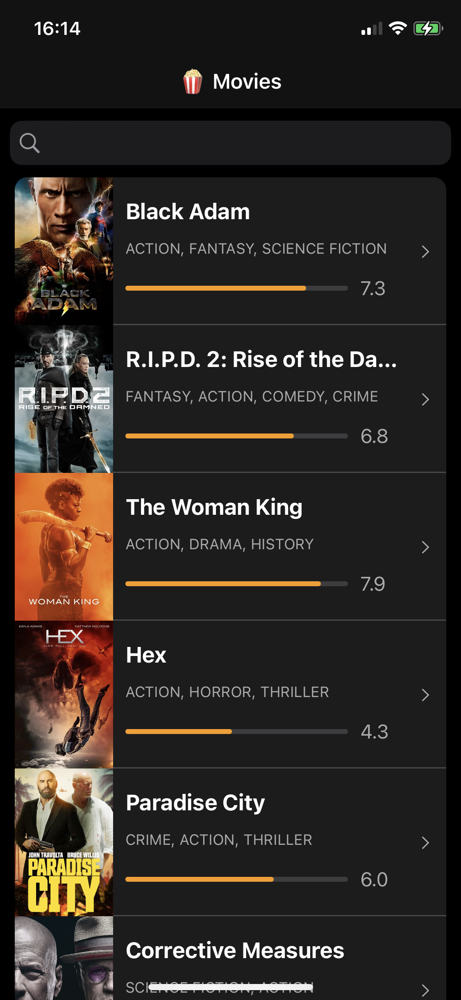
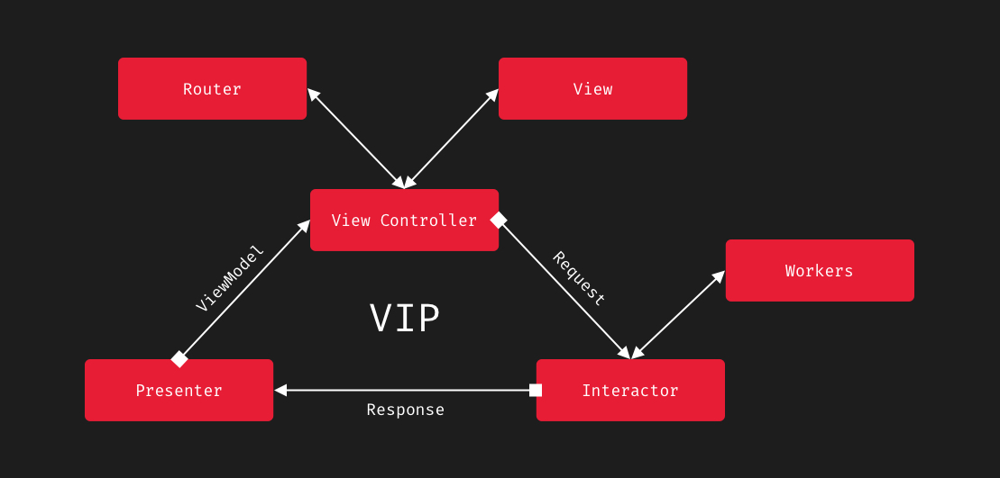

# MovieList

## Stack
* **Environment**: Xcode 14.1 (14B47b) 
* **Programming Language**: Swift 
* **Dependency manager**: CocoaPods
* **API Layer**: Moya (3rd-party framework)
* **Image cache**: Kingfisher (3rd-party framework)
* **Autolayout**: SnapKit (3rd-party framework)

## Aarchitecture:

* CleanSwift
    * **Configurator** (Creator for modules with required services)
    * **Router** (Routing between modules)
    * **ViewConrtroller** (Interface components with self **Appearance**)
    * **Interactor** (Busines logic of module: work wirh services/db, workers)
    * **Presenter** (OPresentation logic of module: create a view model to display it on View )

## Structure:

* App 
> Main objects for initialization and startup application.

* Modules
> Application modules based on **CleanSwift architecture**.

* Reusable
> Reusable components .

* Extensions
> Extensions the implementation for system types.

* Services
> Services for working with the network and storage layers. 

* Resources
> Application resources.

## Improvements:
* Add empty and error states for screens
* Handle server errors

